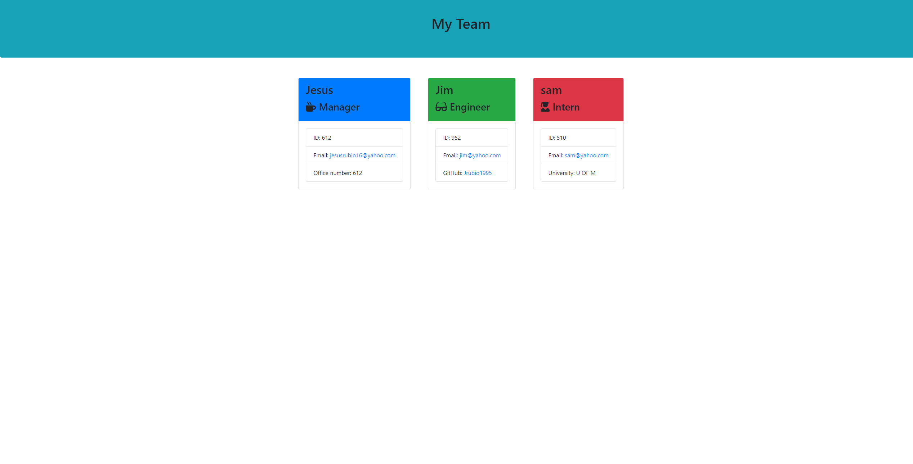
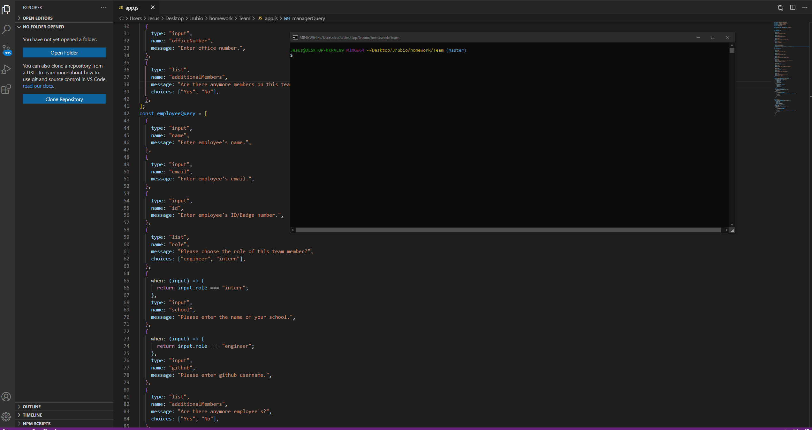

  # Team

  
  
  ## Description 
  
  To setup or organize member of a team or group 

  ## Table of Contents
  
  [Installation](#installation)
  
  [Usage](#usage)
  
  [Contributing](#contributing)
  
  [Tests](#tests)
  
  [Questions](#questions)
  
  [License](#license)

  ## Installation
  
  download and run on bash. (make sure a npm's are installed)

  ## Usage
  
  In a group project or in a workplace

  ## Contributing
  
  

  ## Tests
  
  undefined

  ## Questions
  
  Github username : Jrubio1995
  
  Link to my profile: https://github.com/Jrubio1995
  
  If you have any additional questions, you can reach me at jesusrubio16@yahoo.com. 

  ## License 
  
  Licensed under the Unlicense license. 
  
